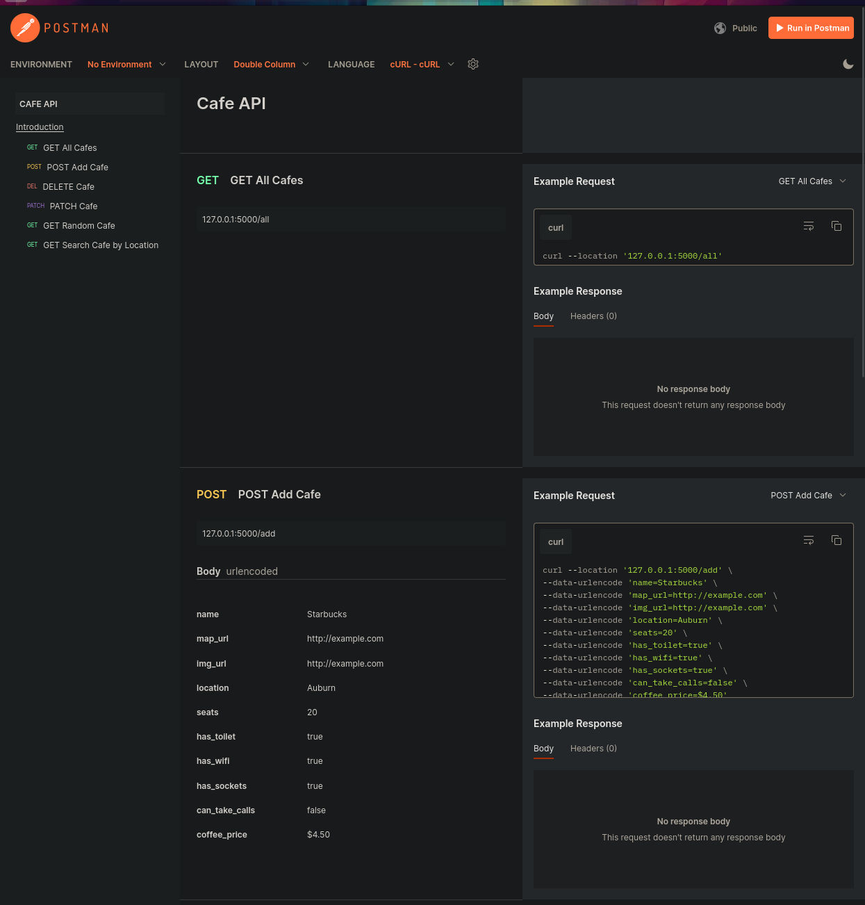

# Flask Cafe API

This repository contains a Flask application that serves as an API for managing cafes. 

## Features

- List all cafes
- Get a random cafe
- Add a new cafe
- Update the price of coffee for a specific cafe
- Report and remove a cafe

## Setup

1. Clone the repository.
```git clone https://github.com/j-breedlove/cafe_api_flask.git```
2. Navigate to project directory.
```cd cafe_api_flask```
3. Install the required packages using `pipenv install`.
3. Run the app with `python app.py`.

## API Endpoints

- `GET /`: Home route rendering an HTML template.
- `GET /random`: Fetches a random cafe.
- `GET /all`: Fetches all the cafes.
- `POST /add`: Adds a new cafe.
- `PATCH /update-price/<int:cafe_id>`: Updates the price for a specific cafe.
- `DELETE /report-closed/<int:cafe_id>`: Deletes a specific cafe.

## Database

The app uses SQLite for database operations and SQLAlchemy as an ORM.

## Security

Some endpoints require an API key for authorization.
